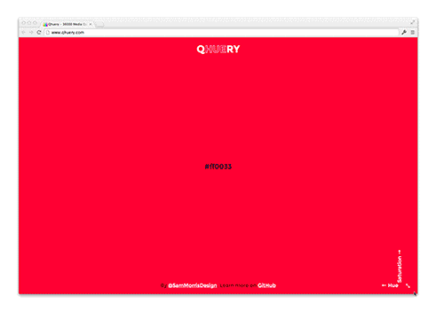

Qhuery
=======

A stupid sass experiment with colours. It generates 3600 media queries that change background colour.

## Demo

Visit the real site (Warning, might kill your browser). Here's a gif preview just in case.

## Requirements

- Ruby 1.9.2
- [Node](nodejs.org) with the latest version of Node Package Manager
- [Grunt](http://gruntjs.com/)

## Usage

For the first time use `npm install` to get dependencies and then run `grunt` to watch the sass.

**Warning** the sass takes a long time to compile (around 40 minutes). As a result the repo comes with compiled css.
